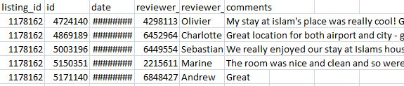
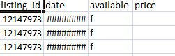
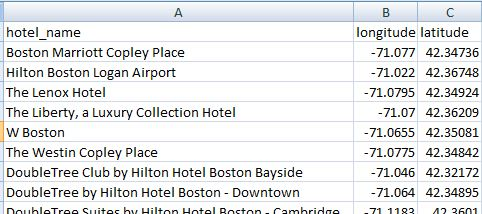

# AnalyzingAirbnbData
In this project, I've analyzed open data of Airbnb provided on Kaggle. I've also used Hotels data and Twitter Data to support my analysis.

# Introduction

For the purpose of this analysis, I am using Boston's Airbnb data provided on Kaggle by Airbnb itself as part of an open competition.
I'll be asking following questions while performing my 5 analysis on this dataset:

1. How does neighborhood affect distribution of listings in Boston area?
2. Why would anyone prefer to stay in Airbnb over hotels while visting Boston?
3. How the sentiments of customers are over the social media after their stay at Airbnb in Boston?
4. Are you more likely to be airbnb if you own Condominium rather than Apartment? Boats are pretty famous too ib Boston, but would anyone want to stay in a boat than a regular apartment? 
5. What does the performance of listings change as the price of the rental changes?
          
# Pre-requisites

For this analysis, I have used following libraries. You can also get them by using the following simple command:

``` 
pip install <library_name> 
```
1. Requests
2. OAuth1 from requests_oauthlib
3. json
4. os
5. time
6. glob
7. Pandas
8. Numpy
9. Matplotlib
10. Seaborn
11. Textblob
12. datetime
13. gmplot

# Data Used

Following dataset are used to support my analysis on airbnb data:

## 1. Airbnb Boston Dataset

The data I collected for Airbnb was rather huge with 95 columns in total. Below is the video representation of all those rows which couldn't be contained in an image.

### a. Listings Data


### b. Reviews Data


### c. Calendar Data


## 2. Listings of all the hotels in Boston

Following is the data for all the hotels in Boston that I collected



## 3. Twitter data for airbnb boston
          
# Analysis Results

## Analysis 1 -- What to expect where in Boston?

Through this analysis, I aimed to find out the distribution of listings over different neighbourhood in Boston region.


## Analysis 2 -- Why Airbnb over hotels?

In this analysis, I gathered latitudes and longitudes from Airbnb listings and Hotel listings.


I also analyzed the neighborhood in Boston where the prices of listings are expensive compared to cheaper options.


To determine the change in price, I used circles of different sizes with varying colors. Below is the colorbar describing what each of those colors represent.


To provide a better reprentation of this comparision, I plotted all the locations on live google map. Below is the video for it.


GIF created with [LiceCap](http://www.cockos.com/licecap/).

## Analysis 3 -- Changes in behavior of customers?

In this analysis, I studied the behavior of customer over different factors - how it changed over time and how they behave over different social media.

To answer first question, I find out the sum of all the reviews made over a period of time.

```
review_count_dates = pd.to_datetime(reviews['date']).value_counts().resample('D').mean().fillna(0)
```
The first graph represents the growth of number of reviews by customer's over time. 


<br/>
To perform this analysis, I used a library called *TextBlob* to determine the polarity of each sentence in a review and then determined the cumulative polarity of that tweet.

```
blob = TextBlob(items["text"])

for sentence in blob.sentences:
                blob.tags
                blob.noun_phrases
                value = sentence.sentiment.polarity
```

However in second graph we see that customers are more likely to put a negative tweet on Twitter if they are dissatified and they are more likely to come back to Airbnb's website to leave a positive review if they are satisfied.


## Analysis 4 -- Airbnb property information.

From first graph, it is rather clear that an Airbnb customer shall expect Apartment kind of property over Condominium, independent houses or townships.


Drilling down, they should also expect entire home or apartment to themselves than staying in a shared or private room.


Drilling down even further, they can expect real beds for themselves than having to sleep on Pull-on sofa, Futon, Airbnb, Couch.


## Analysis 5 -- Airbnb's listings performance over price

To determine how customer's behave as they pay more for the rental I took two columns from two different .csv files and performed following operation:

```
review_num = pd.DataFrame(reviews.groupby(level=0).agg(len)['id'])
price_id = pd.DataFrame(new_calDF.groupby(level=0).agg(np.mean))
```

and the finally merged them --

```
price_rev = pd.merge(review_num,price_id,
                    how='inner',
                    left_index=True,
                    right_index=True)
```

As the price of the listings increases, lesser number of people take out time to review them on airbnb.


Also, as more and more hosts are joining Airbnb, the price per bedroom is increasing over time.


