# AnalyzingAirbnbData
In this project, I've analyzed open data of Airbnb provided on Kaggle. I've also used Hotels data and Twitter Data to support my analysis.

# Introduction

For the purpose of this analysis, I am using Boston's Airbnb data provided on Kaggle by Airbnb itself as part of an open competition.
I'll be asking following questions while performing my 5 analysis on this dataset:

1. How does neighborhood affect distribution of listings in Boston area?
2. Why would anyone prefer to stay in Airbnb over hotels while visting Boston?
3. How the sentiments of customers are over the social media after their stay at Airbnb in Boston?
4. Are you more likely to be airbnb if you own Condominium rather than Apartment? Boats are pretty famous too ib Boston, but would anyone want to stay in a boat than a regular apartment? 
5. What is the performance of occupancy of listings?
          
# Pre-requisites

For this analysis, I have used following libraries. You can also get them by using the following simple command:

``` 
pip install <library_name> 
```
1. Requests
2. OAuth1 from requests_oauthlib
3. json
4. os
5. time
6. glob
7. Pandas
8. Numpy
9. Matplotlib
10. Seaborn
11. Textblob
12. datetime
13. gmplot

# Data Used

Following dataset are used to support my analysis on airbnb data:

1. Airbnb Boston Dataset
2. Listings of all the hotels in Boston
3. Twitter data for airbnb boston
          
# Analysis Results

## Analysis 1 -- What to expect where in Boston?

Through this analysis, I aimed to find out the distribution of listings over different neighbourhood in Boston region.

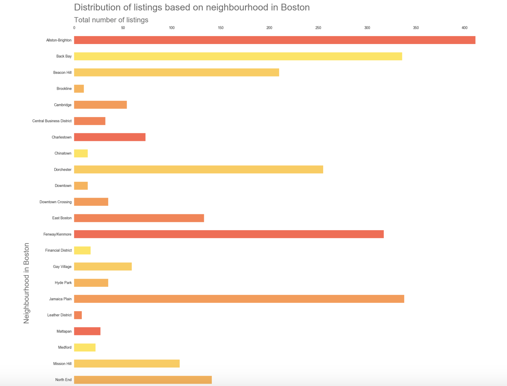
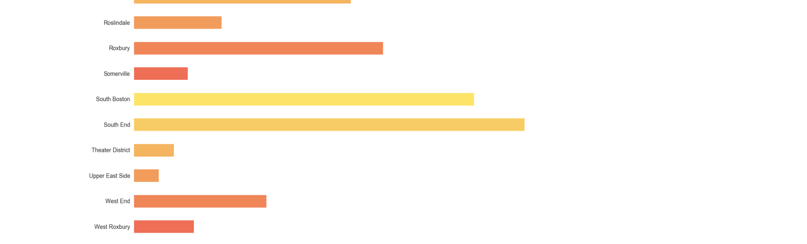

## Analysis 2 -- Why Airbnb over hotels?

In this analysis, I gathered latitudes and longitudes from Airbnb listings and Hotel listings.

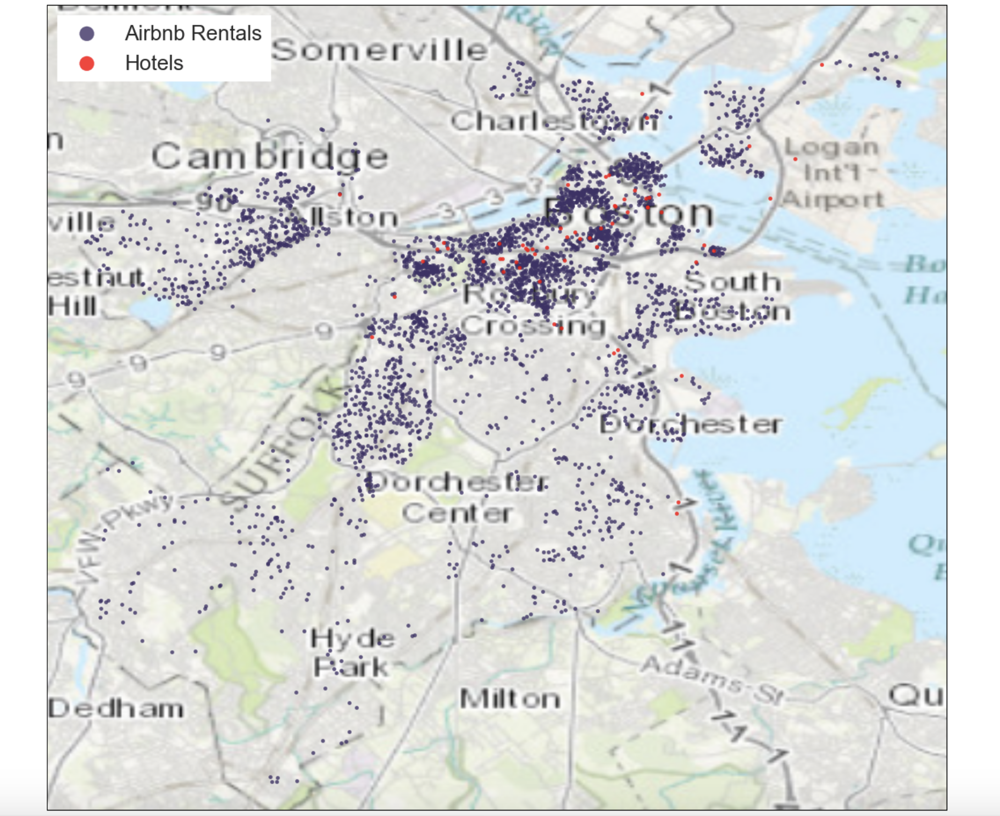

I also analyzed the neighborhood in Boston where the prices of listings are expensive compared to cheaper options.

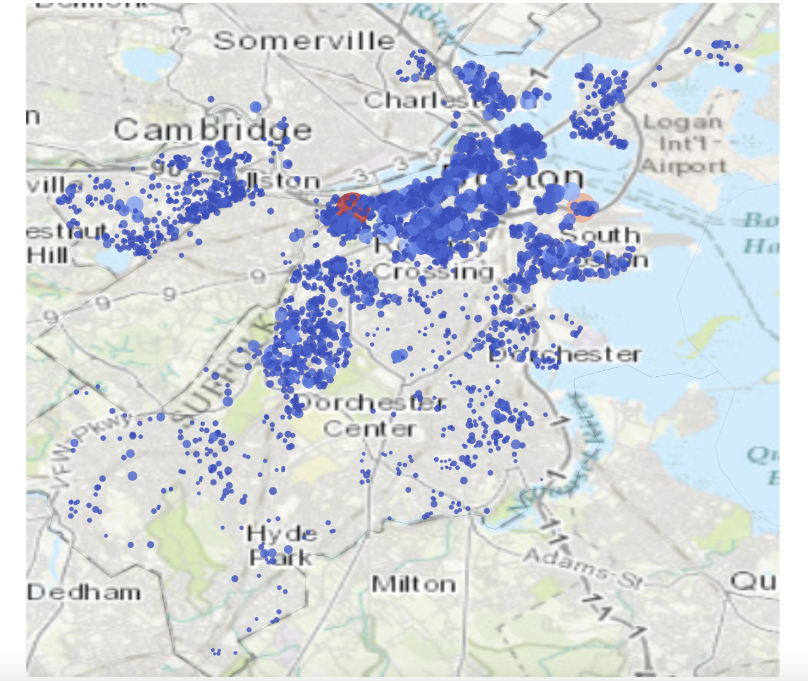

To determine the change in price, I used circles of different sizes with varying colors. Below is the colorbar describing what each of those colors represent.

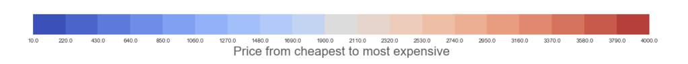


GIF created with [LiceCap](http://www.cockos.com/licecap/).

## Analysis 3 -- Changes in behavior of customers?

The first graph represents the growth of number of reviews by customer's over time.

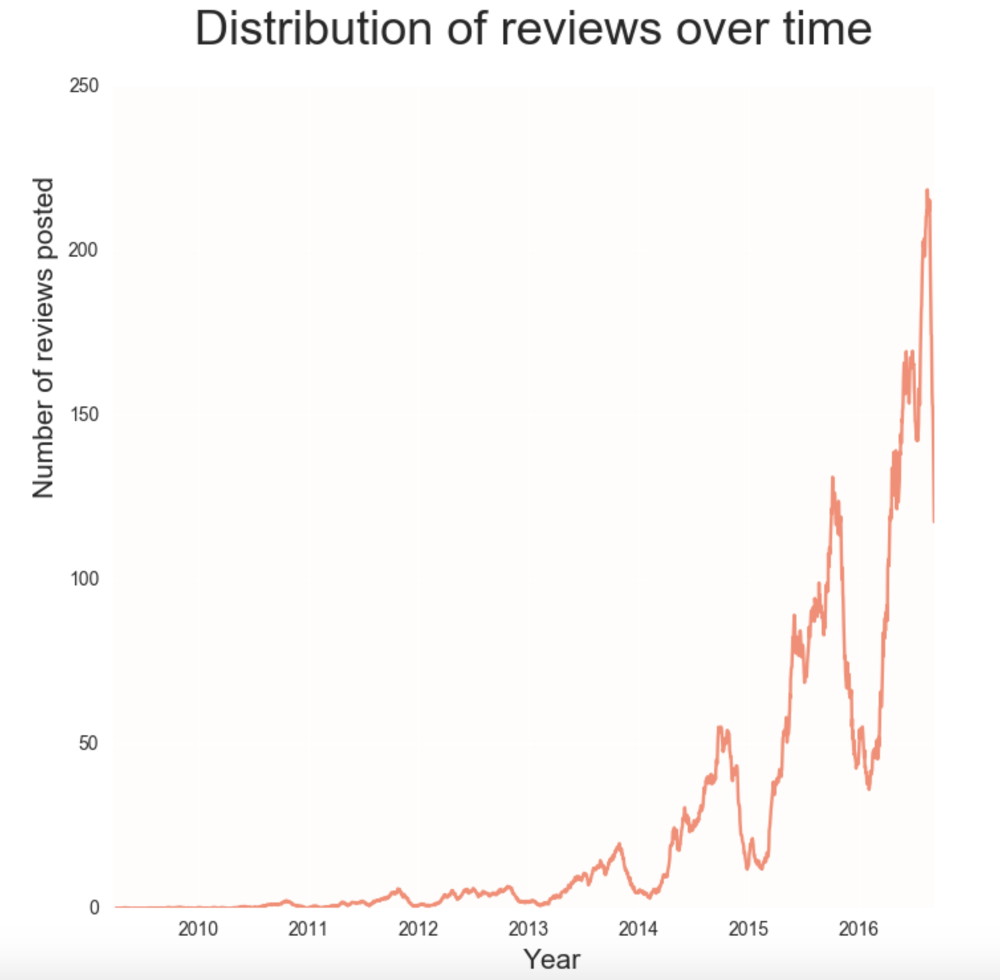

<br/>
However in second graph we see that customers are more likely to put a negative tweet on Twitter if they are dissatified and they are more likely to come back to Airbnb's website to leave a positive review if they are satisfied.

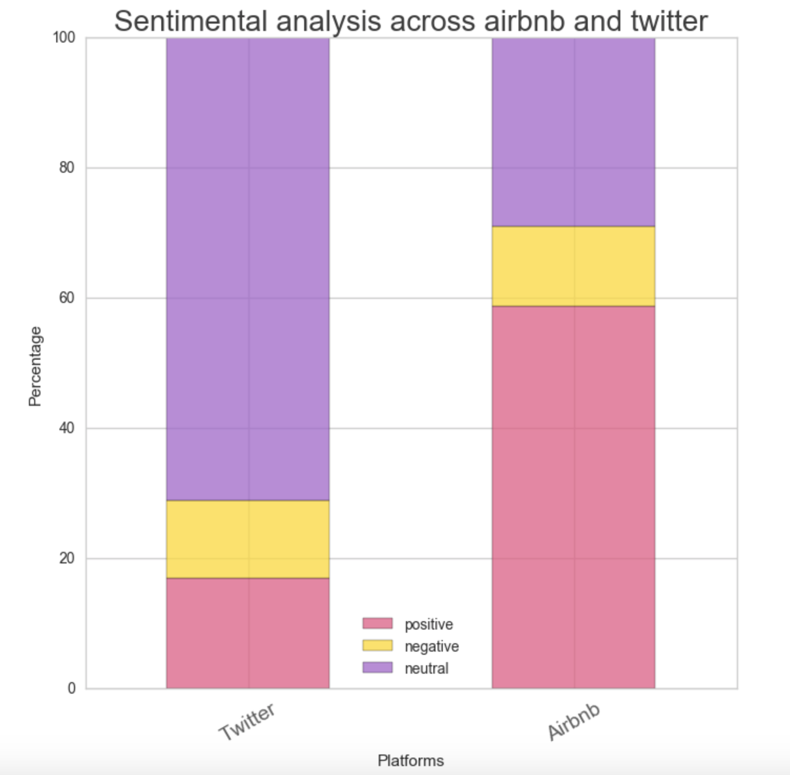

## Analysis 4 -- Airbnb property information.

From first graph, it is rather clear that an Airbnb customer shall expect Apartment kind of property over Condominium, independent houses or townships.

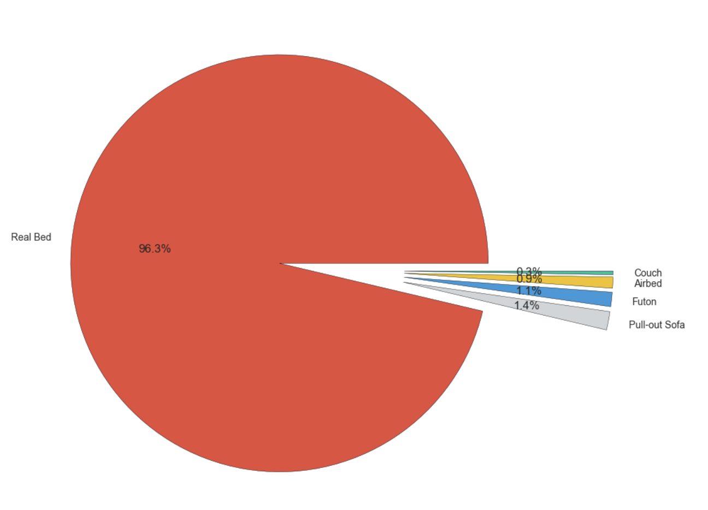

Drilling down, they should also expect entire home or apartment to themselves than staying in a shared or private room.

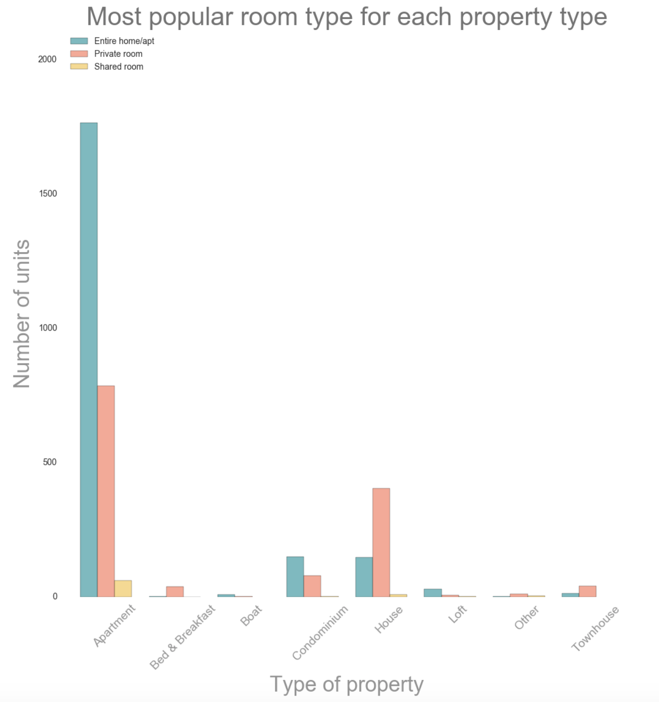

Drilling down even further, they can expect real beds for themselves than having to sleep on Pull-on sofa, Futon, Airbnb, Couch.

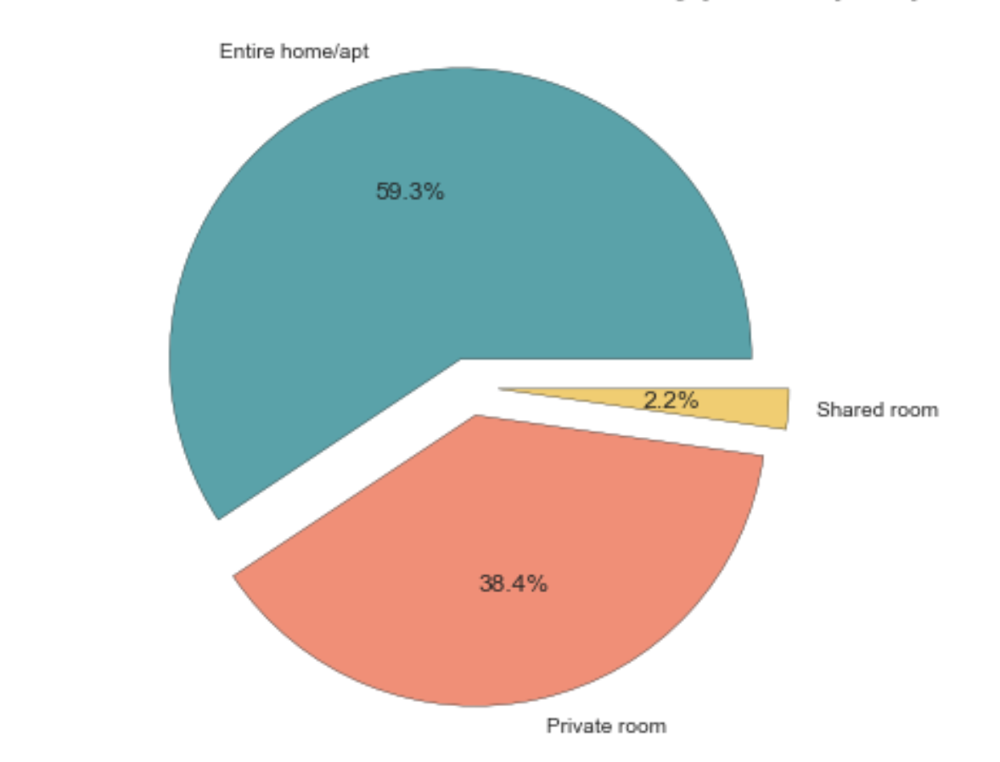

## Analysis 5 -- Airbnb's listings performance over time

In this analysis, I will be analyzing the performace of listing over time.
I'll also be analyzing the occupancy trends against the pricing of that listing.

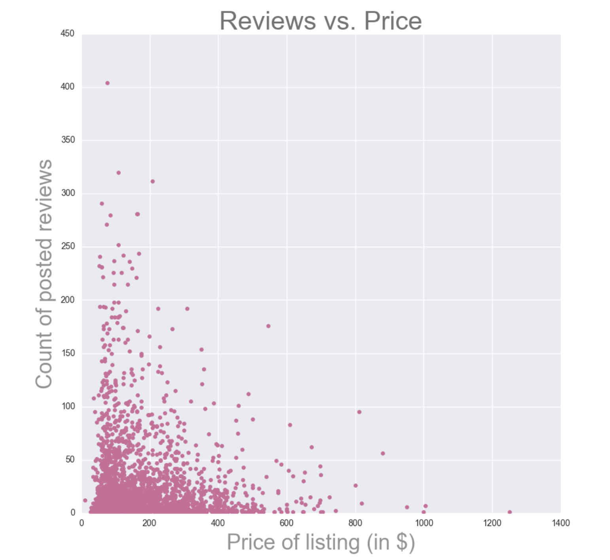
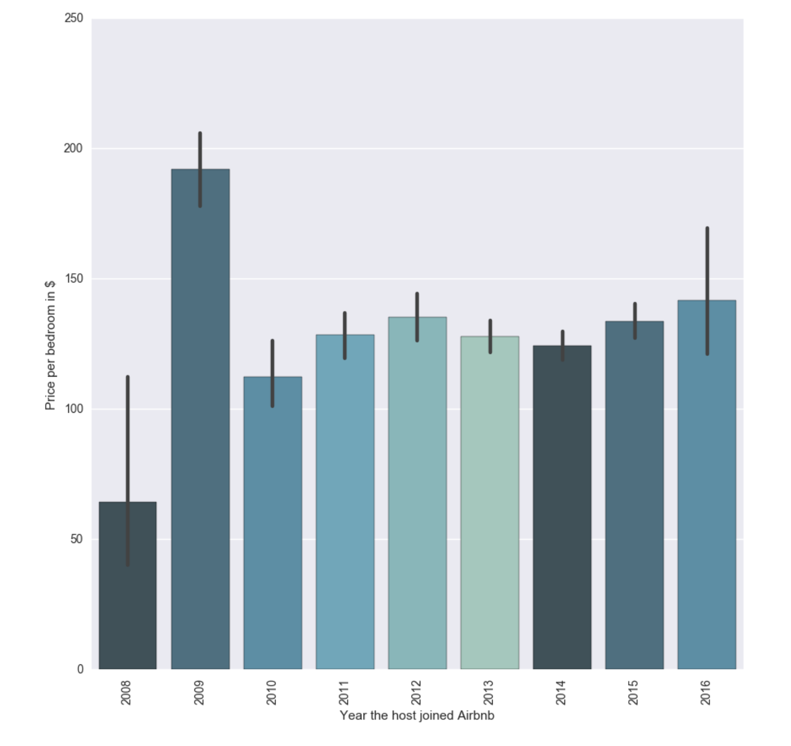
